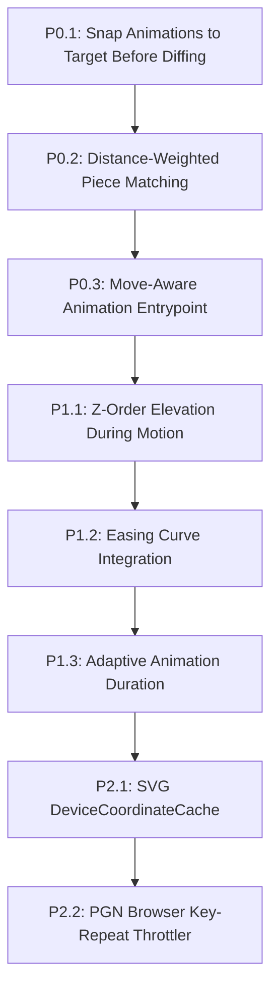

# Chessboard Animation System: Review, Architecture & Improvement Plan

## 1. Executive Summary & Overview

This document provides an in-depth analysis of the animation and rendering subsystem within the `gchessboard` widget suite—covering both the SVG GraphicsScene implementation ([`BoardScene`](file:///C:/Users/ASUS/programming/qt_programs/chess/gchessboard/src/scene.py#L42) / [`BoardView`](file:///C:/Users/ASUS/programming/qt_programs/chess/gchessboard/src/view.py#L12)) and the font-rasterized painter widget ([`PainterChessBoard`](file:///C:/Users/ASUS/programming/qt_programs/chess/gchessboard/src/painter_board.py#L174)).

It captures the root causes of piece "trembling", floating artifacts, and visual clipping during rapid move sequences (such as fast-scrubbing in a PGN browser or automated playback), compares them against industry-standard engines (**Lichess / Chessground**, **Chess.com**, and **ChessBase**), and presents a prioritized, step-by-step roadmap for upgrading the animation engine to achieve fluid, robust performance.

---

## 2. Current Implementation Review & Root Causes

### 2.1 The Mid-Flight Interruption & Coordinate Freezing Issue
* **Location:** [`scene.py#L523-L525`](file:///C:/Users/ASUS/programming/qt_programs/chess/gchessboard/src/scene.py#L523-L525)
* **What happens:**
  ```python
  self._anim_group.stop()
  self._anim_group.clear()
  ```
* **Problem:** In Qt, calling `.stop()` on a running `QPropertyAnimation` halts the item at its **current fractional pixel coordinate** (e.g., halfway across the board). When `set_fen()` immediately proceeds to rebuild the piece dictionary, it evaluates items from these intermediate, unanchored coordinates rather than exact square locations.

### 2.2 Piece Identity Confusion in FEN Diffing
* **Location:** [`scene.py#L546-L558`](file:///C:/Users/ASUS/programming/qt_programs/chess/gchessboard/src/scene.py#L546-L558)
* **What happens:** When finding which piece moved to a new square, the code searches through all existing items of the same piece type and color in arbitrary dictionary order:
  ```python
  if not matched_item:
      for old_square, old_item in list(self.piece_items.items()):
          if old_item.piece == piece and new_board.piece_at(old_square) != piece:
              matched_item = self.piece_items.pop(old_square)
              break
  ```
* **Problem:** When navigating rapidly, multiple identical pieces (e.g., white pawns, knights, rooks) are displaced simultaneously or still animating. Grabbing the first arbitrary dictionary match pairs the destination square with the wrong piece on the other side of the board, causing pawns or pieces to fly across the board diagonally ("floating").

### 2.3 Instant Deletion of Unmatched Items (Disappearing Pieces)
* **Location:** [`scene.py#L597-L598`](file:///C:/Users/ASUS/programming/qt_programs/chess/gchessboard/src/scene.py#L597-L598)
* **What happens:**
  ```python
  for item in self.piece_items.values():
      self.removeItem(item)
  ```
* **Problem:** If piece matching pairs the wrong item, the legitimate piece item is left over in the pool and removed from the scene immediately. When moves fire in rapid succession, pieces appear to vanish or flicker.

### 2.4 Z-Ordering and Visual Clipping
* **Location:** [`scene.py#L560-L585`](file:///C:/Users/ASUS/programming/qt_programs/chess/gchessboard/src/scene.py#L560-L585)
* **Problem:** Moving pieces stay at the default $Z = 0$. When an animated piece flies across other occupied squares (e.g., a knight leaping over pawns, or long bishop/queen slides), Qt renders them in insertion order. The in-flight piece can slip underneath stationary pieces or square highlights.

### 2.5 Linear Easing vs. Natural Deceleration
* **Location:** [`scene.py#L572-L576`](file:///C:/Users/ASUS/programming/qt_programs/chess/gchessboard/src/scene.py#L572-L576)
* **Problem:** `QPropertyAnimation` defaults to `QEasingCurve.Linear`. Linear velocity feels robotic and rigid; when canceled abruptly, it produces a jarring velocity discontinuity.

---

## 3. Industry Comparison: How Modern Chess Apps Handle Rapid Moves

```
┌────────────────────────────────────────────────────────────────────────────────────────┐
│                                 Handling Rapid Moves                                   │
├──────────────────────────┬─────────────────────────────┬───────────────────────────────┤
│    Lichess (Chessground) │         Chess.com           │           ChessBase           │
├──────────────────────────┼─────────────────────────────┼───────────────────────────────┤
│ • Dynamic duration:      │ • Cancels previous move &   │ • Throttled event loop:       │
│   Scales down from 200ms │   snaps to destination      │   Locks step rate to frame    │
│   to 30ms/0ms under load │   before diffing next state │   duration (e.g., ~60ms/move) │
│ • Atomic piece keys:     │ • Move-aware transitions    │ • Sequential execution:       │
│   Pieces are keyed to    │   (tracks Move objects,     │   Never starts Move N+1       │
│   prevent cross-matching │   not just raw FEN diffs)   │   until Move N is positioned  │
└──────────────────────────┴─────────────────────────────┴───────────────────────────────┘
```

### Key Takeaway for `gchessboard`:
1. **The application (PGN viewer)** is responsible for pacing autoplay replays (e.g. `Timer >= animation_duration + pause`).
2. **The widget (`BoardScene` / `PainterChessBoard`)** must be resilient to user-driven rapid bursts (e.g., holding arrow keys or rapid-clicking), ensuring it snaps pending animations to completion, prevents piece cross-matching, and optionally scales down animation duration.

---

## 4. Prioritized Improvement Roadmap



---

### Priority 0: Critical Stability & Glitch Elimination

#### 1. Snap Active Animations to Destination Before Re-Diffing
* **Priority:** P0 (Highest)
* **Difficulty:** Low
* **Files affected:** [`src/scene.py`](file:///C:/Users/ASUS/programming/qt_programs/chess/gchessboard/src/scene.py)
* **Description:** Before clearing `self._anim_group` in `set_fen()`, iterate over all running child animations and force their target item directly to `anim.endValue()`.
* **Before changing:** Verify how `_anim_group` tracks individual animations (`animationAt(i)` in Qt).
* **When changing:** Ensure piece coordinates are fully updated in the Qt scene coordinate system before calculating Manhattan distances for the next move.

#### 2. Distance-Weighted Piece Matching Heuristic
* **Priority:** P0 (Highest)
* **Difficulty:** Medium
* **Files affected:** [`src/scene.py`](file:///C:/Users/ASUS/programming/qt_programs/chess/gchessboard/src/scene.py)
* **Description:** When matching an ambiguous piece (e.g., pawn moves from $e2 \to e4$, but other pawns exist on board), calculate the Euclidean / Manhattan distance between `old_square` and `new_square`. Pick the candidate with the **smallest distance**, rather than the first match in `self.piece_items`.
* **Before changing:** Consider castling ($e1 \to g1$ + $h1 \to f1$) and pawn promotions (pawn morphs into queen).
* **When changing:** Ensure castling rook pairs are prioritized to prevent the king and rook from cross-animating.

#### 3. Explicit Move-Aware Animation Support
* **Priority:** P0 (Highest)
* **Difficulty:** Low–Medium
* **Files affected:** [`src/scene.py`](file:///C:/Users/ASUS/programming/qt_programs/chess/gchessboard/src/scene.py), [`src/view.py`](file:///C:/Users/ASUS/programming/qt_programs/chess/gchessboard/src/view.py)
* **Description:** When a move is initiated via `move_piece(move)` or when `last_move` is known, pass `move: Optional[chess.Move]` directly to `set_fen()`. If `move` is provided, animate exclusively `move.from_square -> move.to_square` (and rook for castling) without needing ambiguous FEN diffing.
* **Before changing:** Maintain full backwards compatibility for callers that only supply a raw FEN string.

---

### Priority 1: Animation Fluidity & Polishing

#### 4. Dynamic Z-Index Elevation During Motion
* **Priority:** P1
* **Difficulty:** Low
* **Files affected:** [`src/scene.py`](file:///C:/Users/ASUS/programming/qt_programs/chess/gchessboard/src/scene.py)
* **Description:** Set `item.setZValue(10.0)` when an animation begins, and reset `item.setZValue(0.0)` when the animation group completes.
* **Before changing:** Verify custom highlights ($Z = -1.5$), legal dots ($Z = -1.0$), and shape arrows ($Z = 0.5$) so moving pieces always fly over arrows and other pieces.

#### 5. Easing Curve Integration (`QEasingCurve.OutCubic`)
* **Priority:** P1
* **Difficulty:** Low
* **Files affected:** [`src/scene.py`](file:///C:/Users/ASUS/programming/qt_programs/chess/gchessboard/src/scene.py)
* **Description:** Add `anim.setEasingCurve(QEasingCurve.OutCubic)` or `QEasingCurve.OutQuad` to match the smooth deceleration curve used in [`PainterChessBoard`](file:///C:/Users/ASUS/programming/qt_programs/chess/gchessboard/src/painter_board.py#L675).
* **Before changing:** Check if duration needs slight tuning (e.g., 180ms–200ms feels natural with OutCubic).

#### 6. Adaptive Duration / Fast-Scrubbing Throttling
* **Priority:** P1
* **Difficulty:** Medium
* **Files affected:** [`src/scene.py`](file:///C:/Users/ASUS/programming/qt_programs/chess/gchessboard/src/scene.py), [`src/models.py`](file:///C:/Users/ASUS/programming/qt_programs/chess/gchessboard/src/models.py)
* **Description:** Track the timestamp of consecutive `set_fen()` calls. If calls arrive $< 80\text{ms}$ apart:
  - Scale down animation duration dynamically (e.g. $40\text{ms}$), or
  - Temporarily bypass animations for intermediate steps until the user pauses.
* **Before changing:** Ensure single clicks at normal speeds retain full animation duration.

---

### Priority 2: Performance & Ecosystem Enhancements

#### 7. SVG Rendering Optimization via Coordinate Caching
* **Priority:** P2
* **Difficulty:** Low
* **Files affected:** [`src/pieces.py`](file:///C:/Users/ASUS/programming/qt_programs/chess/gchessboard/src/pieces.py)
* **Description:** In `PieceItem.__init__()`, set `self.setCacheMode(QGraphicsItem.DeviceCoordinateCache)`.
* **Benefit:** Prevents re-evaluating SVG vector paths every frame during smooth translation.

#### 8. PGN Browser Integration & Replay Controller Guidelines
* **Priority:** P2
* **Difficulty:** Medium
* **Files affected:** External app / PGN browser integration layer
* **Description:**
  - In autoplay mode: Use a `QTimer` where `interval = board.animation_duration + hold_delay`.
  - In manual scrubbing (keyboard arrow holding): Discard duplicate key-repeat events or trigger fast-forward mode with $0\text{ms}$ animation.

---

## 5. Edge Cases to Account For Before & During Implementation

1. **Castling ($O-O$ and $O-O-O$):**
   - Both the King ($e1 \to g1$) and Rook ($h1 \to f1$) must animate in parallel without cross-matching or deleting the rook.
2. **Pawn Promotion:**
   - The moving pawn reaches the 8th/1st rank and changes piece type to a Queen/Knight. Diffing must recognize this as a move + replacement rather than an unmatched disappear/appear.
3. **En Passant Captures:**
   - The captured pawn is on a different square ($e5$) than the moving pawn's destination ($e6$). The captured pawn must be removed cleanly without animating into the destination.
4. **Board Orientation Flip:**
   - When calling `flip_orientation()`, all pieces move to inverted coordinates. If animations are enabled during a flip, all 32 pieces animate across the board; it is generally preferable to set `instant=True` during orientation flips.
5. **Premoves & Drag-and-Drop Dropback:**
   - If a user drops a piece on an illegal square or sends a premove, the piece must smoothly snap back to its origin square without triggering a FEN change animation.
